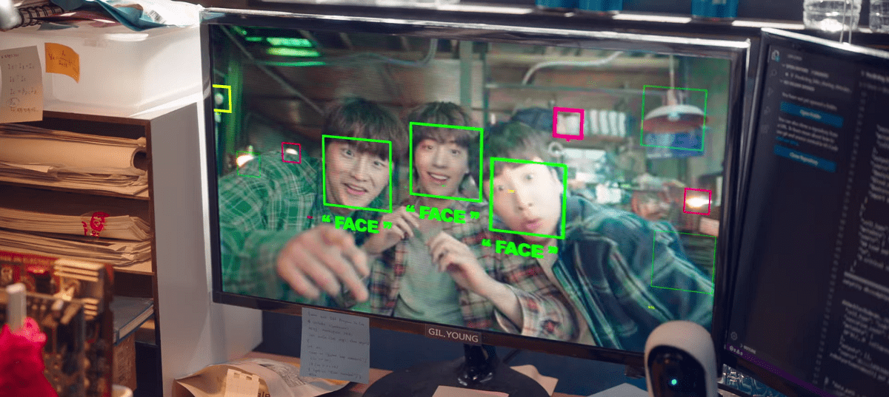
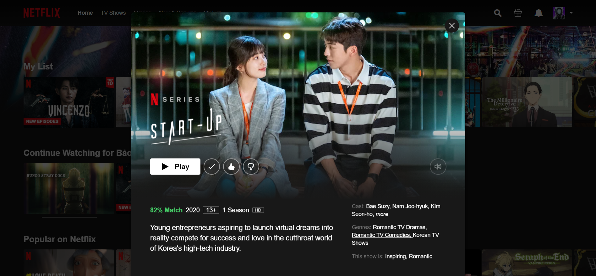
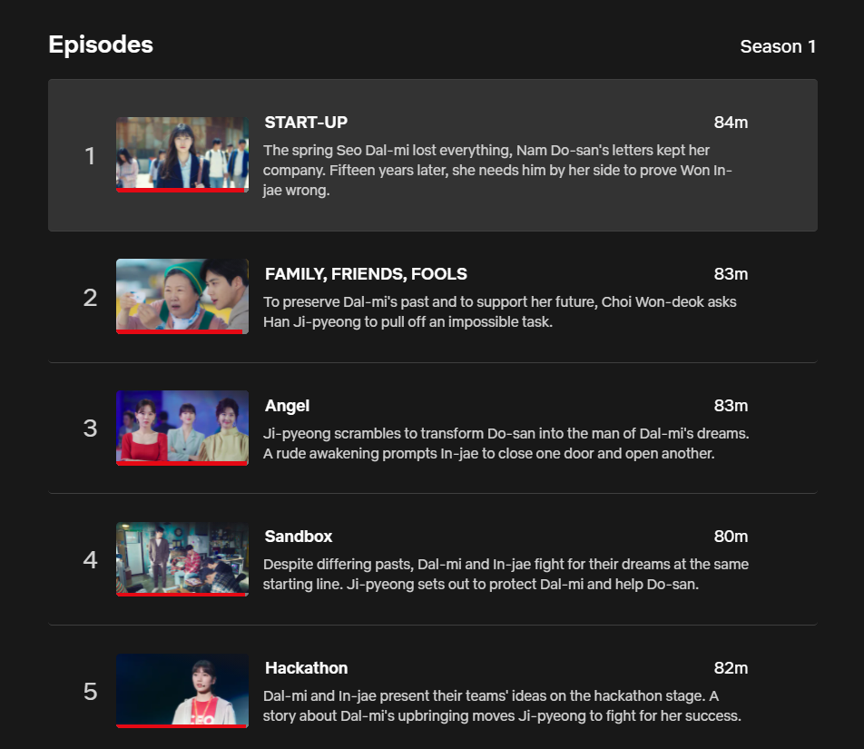
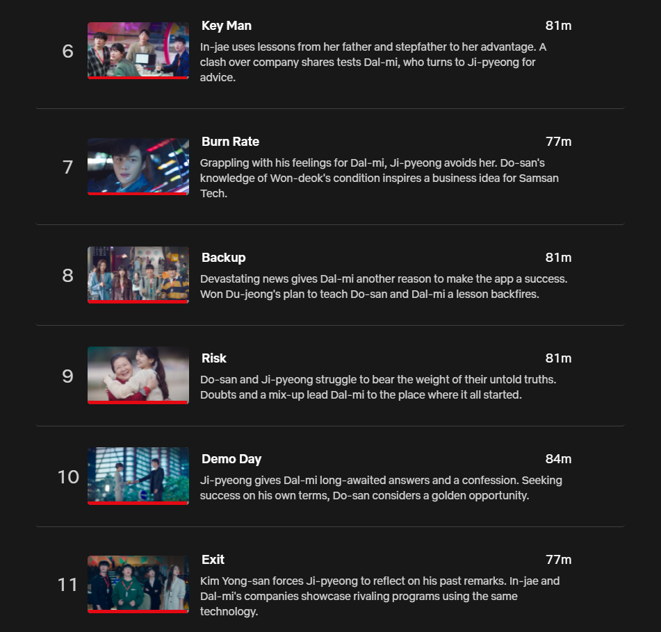
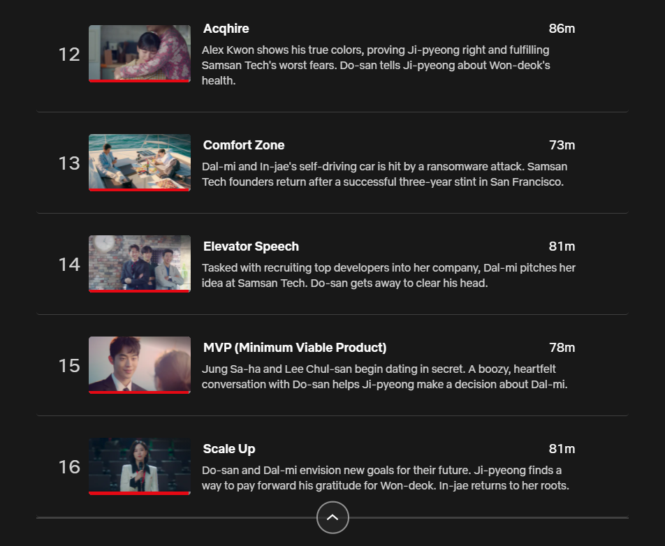

Three SamsanTech members, Nam Do-san, Kim Yong-san, and Lee Chul-san, are working on computer vision - image recognition/classification, an **artificial intelligence** field. The concept of technology was the main theme of this drama. Isn't it intriguing?! (It's for this reason that I opted to watch this film, despite the fact that I'm not usually interested in K-Drama.)

👉 ⚠ *Spoiler Alert. I suggest that you should watch the film before reading this post.*

Three of them competed in CODA, a fictitious machine learning competition centered in Silicon Valley. They actually won, despite their low expectations. The company SamsanTech becomes well-known. Investors come to their offices to learn more about their capabilities. All of the investors, on the other hand, abandon ship. What is the reasoning for this?

Because SamsanTech doesn't have a solid business model to begin with. They just have "the algorithm", "the high-accuracy prototype", "machine learning technology".

* What Do-san and his friends care about: Optimize the algorithm, enhance the accuracy of the image recognition system.
* What investors care about: How this amazing technology can be monetized. 

Investors don't understand why "changing the parameters or adding an extra layer to the CNN (Convolutional Neural Network) enhances accuracy." They just care if it works, is applicable in the real world, and profitable.

Therefore, what I got is:

* Brilliant minds and cutting-edge technology are not enough.
* A startup must have a clear vision of what it wants to accomplish and how it plans to generates revenue.

Because it’s a business, not a personal or j4f project.

Look at all of the names of the episodes, if you are a tech insider, you will want to watch it. I personally suggest this drama, you should have a try!

